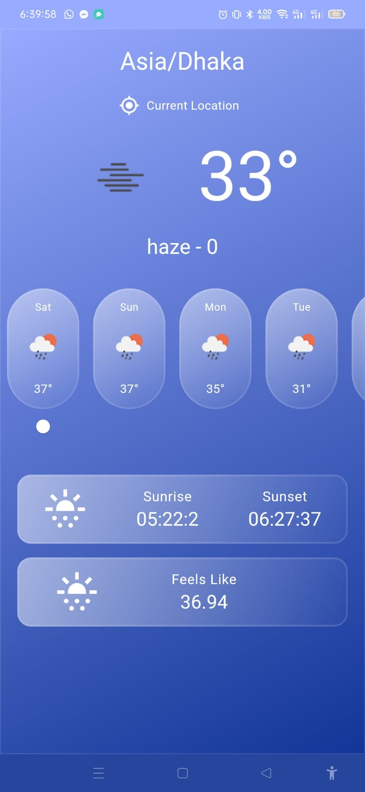
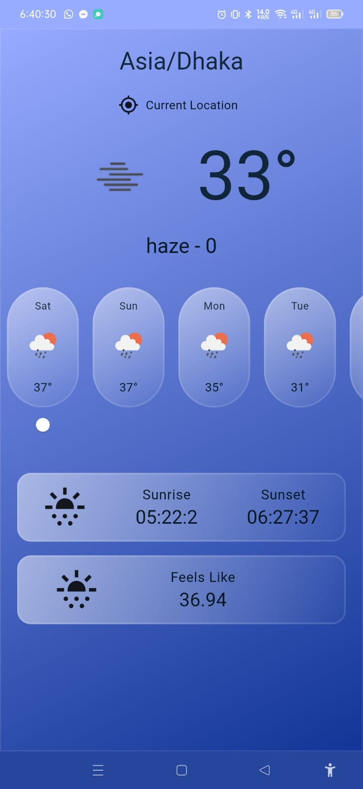

<h1>weather Assessment</h1>

This project follows a structured architecture inspired by MVVM (Model-View-ViewModel) principles to enhance maintainability and scalability. It is organized into different directories, each serving a specific purpose.

<h2>Download Apk <a href="https://drive.google.com/drive/folders/1xvTwNib3G8GTwGqVN4OY0iRGeSscObnF?usp=sharing">Google Drive</a>.</h2>

<h2>Project Structure</h2>

<pre>
lib
|-- app
|   |-- core
|   |   |-- base
|   |   |-- provider
|   |   |-- route
|   |   |-- service
|   |   |-- values
|   |-- data
|   |   |-- local
|   |   |-- remote
|   |   |-- repository
|   |-- modules
|   |   |-- home
|   |   |   |-- view
|   |   |   |-- controller
|   |   |-- weather
|   |   |   |-- view
|   |   |   |-- controller
|   |-- network
|   |   |-- exception
|   |   |-- client
|   |-- utils
|-- flavors
|-- main_dev.dart
|-- main_prod.dart
</pre>

<h3>Directory Structure</h3>

<ul>
  <li><strong>core:</strong> Core functionality including base classes, providers, routes, services, and constant values.</li>
  <li><strong>data:</strong> Data layer containing local (database) and remote (API) data sources and repositories.</li>
  <li><strong>modules:</strong> Feature-based organization, each module represents a feature in the app (e.g., home, details).</li>
  <li><strong>network:</strong> Network-related classes, including exceptions and HTTP client.</li>
  <li><strong>utils:</strong> Utility functions and helpers.</li>
</ul>

<h2>Task Description:</h2>

<ul>
  <li><strong>Weather API Integration:</strong> Retrieve a data from the open weather  API.</li>
  <li><strong>Weather Forecast:</strong> Display the forecast for the next 7 days, including the date, weather icon, and temperature..</li>
  <li><strong>Local Database (Hive):</strong> Store the fetched data locally and show to view when internet is off using Hive.</li>
  <li><strong>Geolocator</strong> Implement location services to automatically determine the user's location (latitude and longitude).</li>
    <li><strong>Provider for State Management:</strong> Utilize the Provider package for state management.</li>
  <li><strong>Service locator:</strong> Decouple the interface(abstract base class) from a concreate implementation.</li>
    <li><strong>Singleton:</strong> Dio and env setup implemented in singleton.</li>
     <li><strong>Theme:</strong> Duel theme setup by system theme.</li>
    
    
</ul>

<h3>Demo Images</h3>

  

    
  

  

    
  

  

    
  

<h3>Flavors</h3>

<ul>
  <li><strong>flavors:</strong> Configuration files for different app flavors like dev & prod.</li>
</ul>

<h3>Entry Points</h3>

<ul>
  <li><strong>main_dev.dart:</strong> Entry point for the development environment.</li>
  <li><strong>main_prod.dart:</strong> Entry point for the production environment.</li>
</ul>

<h2>Getting Started</h2>

<ol>
  <li>Clone the repository:</li>

  <pre><code>git clone https://github.com/niajnm/Weather-Assessment.git</code></pre>

  <li>Switch to the appropriate branch (e.g., <code>develop</code>):</li>

  <pre><code>git checkout develop</code></pre>

  <li>Install dependencies:</li>

  <pre><code>flutter pub get</code></pre>

  <li>Run this command:</li>

  <pre><code>flutter gen-l10n</code></pre>

  <li>Run the app:</li>

  <pre><code>flutter run --flavor dev lib/main_dev.dart --release</code></pre>
  <pre><code>flutter run --flavor prod lib/main_prod.dart --release</code></pre>
</ol>

<h2>License</h2>

This project is licensed under the <a href="LICENSE">MIT License</a>.

